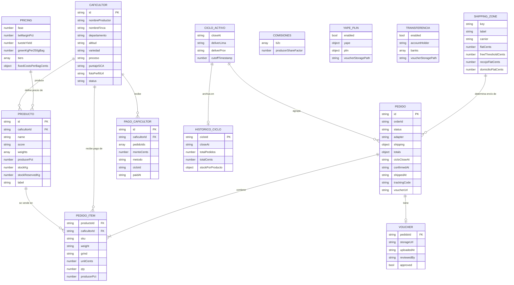
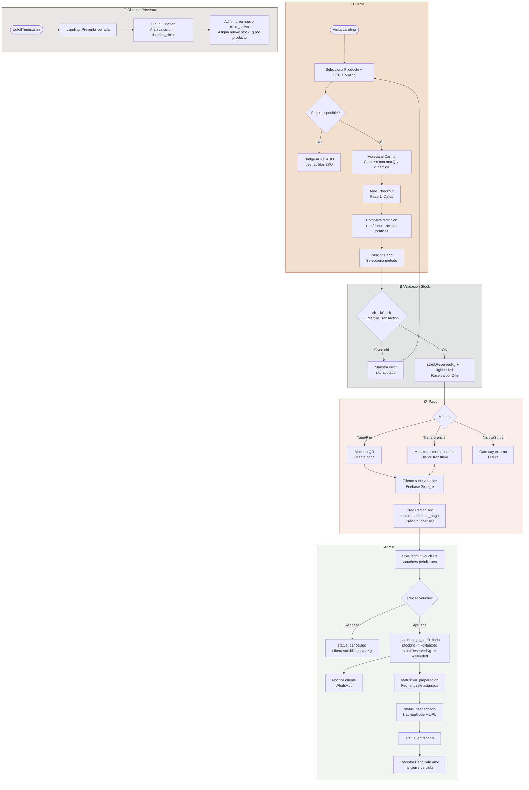
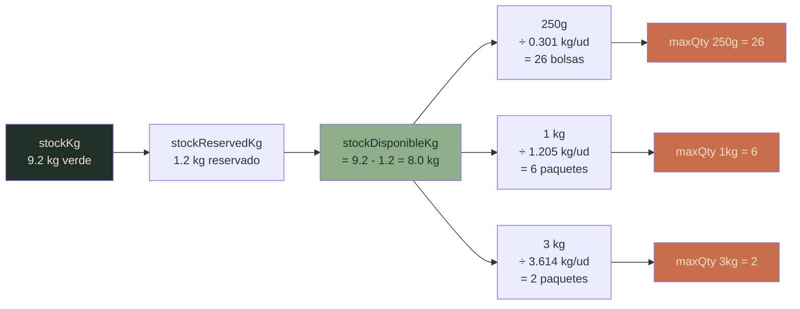
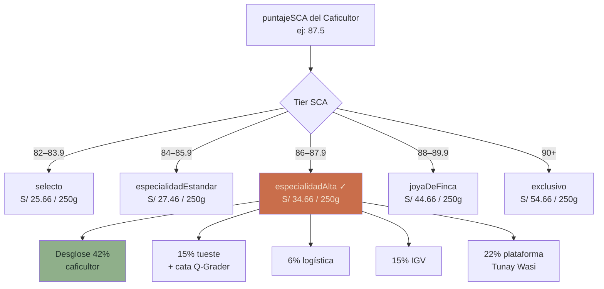
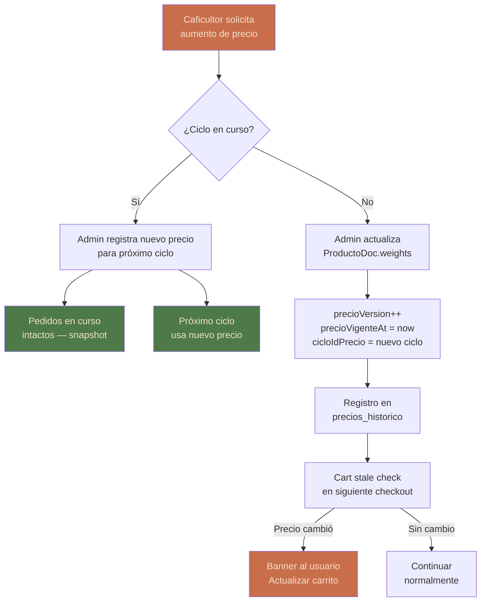

# Propuesta: Control de Inventario y Gestión Operativa — Tunay Wasi Landing

---

## Diagrama de Entidades y Procesos

### A. Entidades — Modelo de Datos (Firestore)



---

### B. Flujo de Compra — Proceso Completo



---

### C. Cálculo de Stock Verde → Unidades



---

### D. Relación Precio → Producto (SCA Score Driven)



---

## Contexto

El sistema actual tiene `stockKg` en cada `ProductoDoc` (ej. 9.2 kg verde) pero **no lo usa**. `checkStock()` en `checkoutService.ts` devuelve siempre `{ ok: true }` — cualquier cantidad puede comprarse sin validación. Tampoco hay deducción de stock al confirmar un pedido. Esta propuesta cubre el circuito completo de inventario + los puntos operativos críticos que faltan.

---

## 1. Modelo de Stock Verde

### Estado actual en `productos.json`
```json
{ "stockKg": 9.2 }  // kg de café verde disponible
```

### Conversión verde → producto final
Con los parámetros ya en `config.json / pricing`:
```
tuesteYield = 0.83          → 1 kg verde = 0.83 kg tostado
greenKgPer250gBag = 0.301   → 1 bolsa 250g consume 0.301 kg verde
```

| SKU | kg verde por unidad |
|-----|-------------------|
| 250g | 0.301 kg |
| 1kg  | 1.205 kg (`1 / 0.83`) |
| 3kg  | 3.614 kg |

**Ejemplo — `stockKg = 9.2` → capacidad máxima:**
| SKU | Unidades disponibles |
|-----|---------------------|
| 250g | 30 bolsas |
| 1kg  | 7 kg |
| 3kg  | 2 paquetes |

### Campo a agregar en `ProductoDoc`
```typescript
stockKg: number;          // ya existe — kg verde en bodega
stockReservedKg: number;  // kg verde reservado por pedidos pendiente_pago
// stockDisponibleKg = stockKg - stockReservedKg (calculado, no almacenado)
```

---

## 2. `maxQty` en Cart — Derivado de Stock

### Problema actual
`maxQty` en `CartItem` es fijo (hardcoded en ProductCard). No refleja stock real.

### Propuesta
Nuevo archivo `src/features/catalog/stockUtils.ts`:

```typescript
export const KG_PER_UNIT: Record<WeightLabel, number> = {
  '250g': 0.301,
  '1kg':  1.205,
  '3kg':  3.614,
};

export function maxQtyForWeight(
  stockDisponibleKg: number,
  weight: WeightLabel
): number {
  return Math.floor(stockDisponibleKg / KG_PER_UNIT[weight]);
}
```

`ProductCard` usa este valor para el selector de cantidad. SKUs con `maxQty === 0` muestran badge "Agotado" y se deshabilitan.

---

## 3. `checkStock()` — Implementación Real

### Ubicación actual: `src/features/checkout/checkoutService.ts` línea ~13
```typescript
// TODO: reemplazar este mock
async function checkStock() { return { ok: true, oversold: [] }; }
```

### Implementación propuesta (Firestore Transaction)

```typescript
async function checkStock(items: CartItem[]): Promise<StockCheckResult> {
  return runTransaction(db, async (tx) => {
    const oversold: OversoldItem[] = [];

    for (const item of items) {
      const ref = doc(db, 'productos', item.productoId);
      const snap = await tx.get(ref);
      const { stockKg, stockReservedKg = 0 } = snap.data()!;
      const disponible = stockKg - stockReservedKg;
      const kgNeeded = KG_PER_UNIT[item.weight] * item.qty;

      if (kgNeeded > disponible) {
        oversold.push({ productoId: item.productoId, sku: item.weight, disponible });
      }
    }

    if (oversold.length > 0) return { ok: false, oversold };

    // Reservar stock (se libera si pago falla o expira)
    for (const item of items) {
      const ref = doc(db, 'productos', item.productoId);
      const kgNeeded = KG_PER_UNIT[item.weight] * item.qty;
      tx.update(ref, { stockReservedKg: increment(kgNeeded) });
    }

    return { ok: true, oversold: [] };
  });
}
```

### Timing de stock
| Momento | Acción en Firestore |
|---------|---------------------|
| Cliente llega al paso Pago | `stockReservedKg += kgNeeded` (reserva) |
| Admin confirma voucher | `stockKg -= kgNeeded`, `stockReservedKg -= kgNeeded` |
| Pago falla / expira 24h | `stockReservedKg -= kgNeeded` (liberar) |

---

## 4. Flujo de Estado del Pedido

### Campo `status` en `pedidos/{uuid}`

```
pendiente_pago
    ↓  (admin confirma voucher / gateway valida)
pago_confirmado
    ↓  (se asigna fecha tueste)
en_preparacion
    ↓  (se genera guía Olva o se prepara delivery)
despachado   →  trackingCode, trackingUrl, shippedAt
    ↓
entregado    →  deliveredAt
```

**Estados adicionales:**
- `cancelado` — admin o cliente antes de `pago_confirmado`
- `reembolsado` — post-confirmación con devolución

### Campos a agregar en `PedidoDoc` (ya existen varios)
```typescript
confirmedAt?:  string;   // ISO — admin confirma pago
shippedAt?:    string;   // ISO — despacho
deliveredAt?:  string;   // ISO
trackingCode?: string;   // código Olva / courier
trackingUrl?:  string;
voucherUrl?:   string;   // Cloudinary URL del voucher
paymentRef?:   string;   // TX ID Niubiz/Stripe
cancelledAt?:  string;
cancelReason?: string;
notes?:        string;   // notas admin
```

---

## 5. Flujo de Confirmación de Voucher (Yape / Transferencia)

### Estado actual
Cliente envía voucher por WhatsApp → admin confirma manualmente → sin registro en sistema.

### Propuesta — nueva colección `vouchers/{pedidoId}`
```typescript
{
  pedidoId:    string;
  storageUrl:  string;        // Firebase Storage: "pedidos/vouchers/{pedidoId}.jpg"
  uploadedAt:  string;        // ISO
  reviewedAt?: string;        // ISO
  reviewedBy?: string;        // email admin
  approved:    boolean | null; // null = pendiente
}
```

**Flujo propuesto:**
1. Cliente sube foto en checkout → Firebase Storage
2. App escribe doc en `vouchers/`
3. Admin ve cola de vouchers en `/admin/vouchers`
4. Admin aprueba → `status = 'pago_confirmado'` + deduce stock + notificación WhatsApp al cliente

---

## 6. Alertas de Stock Bajo

### Cloud Function — `onUpdate` en `productos`
```typescript
exports.stockAlert = onDocumentUpdated('productos/{id}', async (event) => {
  const { stockKg, stockReservedKg = 0, name } = event.data.after.data();
  const disponible = stockKg - stockReservedKg;
  const THRESHOLD_KG = 3.0; // < 3 kg verde = alerta (~10 bolsas 250g)

  if (disponible < THRESHOLD_KG) {
    await sendAdminAlert(`Stock bajo: ${name} — ${disponible.toFixed(1)} kg disponibles`);
    // email a landing.contact.adminEmail (ya en config.json)
  }
});
```

---

## 7. Gestión por Ciclo de Preventa

### `ciclo_activo` actual
Tiene fechas de cierre/entrega y `cutoffTimestamp` pero el stock no está ligado al ciclo.

### Propuesta — `stockPorCiclo` en `ProductoDoc`
```typescript
stockPorCiclo: {
  [cicloId: string]: {  // cicloId = "2026-05" (año-mes del cierre)
    stockKg:    number; // kg verde asignado a este ciclo
    reservedKg: number;
    closedAt?:  string; // cuando admin cerró el ciclo
  }
}
```

**Ventaja:** historial de ventas por ciclo, proyecciones de compra verde.

### Al llegar a `cutoffTimestamp`
1. Landing muestra "Preventa cerrada" (ya funciona con `ciclo_activo`)
2. Cloud Function archiva el ciclo en `historico_ciclos/{cicloId}`
3. Admin crea nuevo `ciclo_activo` con nuevo stock asignado

---

## 8. Panel Admin — Vistas Prioritarias

Rutas bajo `/admin/*` (ya Auth-gated via `PrivateRoute`):

| Vista | URL | Prioridad |
|-------|-----|-----------|
| Cola de vouchers pendientes | `/admin/vouchers` | 🔴 Alta |
| Pedidos con estado completo | `/admin/pedidos` | 🔴 Alta |
| Stock por producto | `/admin/stock` | 🟠 Media |
| Historial de ciclos | `/admin/ciclos` | 🟡 Baja |
| Pagos a caficultores | `/admin/caficultores` | 🟡 Baja |

### Widget de stock en `/admin/stock`
```
Producto           | Verde total | Reservado | Disponible | Cap. 250g | Cap. 1kg
Bello Horizonte    | 9.2 kg      | 1.2 kg    | 8.0 kg     | 26        | 6
Santa Elena        | 5.5 kg      | 0.0 kg    | 5.5 kg     | 18        | 4
```

---

## 9. Pago al Caficultor — Trazabilidad

### Nueva colección `pagos_caficultores/{id}`
```typescript
{
  caficultorId: string;
  pedidoIds:    string[];   // pedidos incluidos en este pago
  montoCents:   number;     // derivado de sum(PedidoDoc.totals.producerShareCents)
  metodo:       'transferencia' | 'efectivo';
  comprobante?: string;     // URL comprobante
  cicloId:      string;     // "2026-05"
  paidAt:       string;     // ISO
  notes?:       string;
}
```

---

## 10. Plan de Implementación por Fases

### Fase 1 — Crítico (antes del próximo ciclo)
- [ ] `stockReservedKg` en `ProductoDoc` + `scripts/data/productos.json`
- [ ] `stockUtils.ts` con `KG_PER_UNIT` y `maxQtyForWeight()`
- [ ] `checkStock()` real con Firestore transaction
- [ ] `maxQty` dinámico en `ProductCard` + badge "Agotado"
- [ ] Status flow en `PedidoDoc` (campos adicionales)

### Fase 2 — Operacional
- [ ] Subida de voucher desde checkout (Firebase Storage)
- [ ] Cola de vouchers en `/admin/vouchers`
- [ ] Deducción automática de stock al confirmar pago
- [ ] Liberación de reserva por timeout (Cloud Function 24h)
- [ ] Panel `/admin/stock` con tabla

### Fase 3 — Analítica
- [ ] `stockPorCiclo` con historial
- [ ] `historico_ciclos` al cerrar ciclo
- [ ] `pagos_caficultores` con trazabilidad
- [ ] Alertas de stock bajo (Cloud Function + email)
- [ ] Dashboard de ventas por ciclo

---

## Archivos Clave a Modificar

| Archivo | Cambio |
|---------|--------|
| `scripts/data/productos.json` | Agregar `stockReservedKg: 0` a cada producto |
| `src/shared/types/catalog.ts` | `stockReservedKg?: number` en `ProductoDoc` |
| `src/shared/types/firestore.ts` | Nuevos tipos: `VoucherDoc`, `PagoCaficultorDoc` |
| `src/features/checkout/checkoutService.ts` | Implementar `checkStock()` con transaction |
| `src/features/catalog/catalogService.ts` | Exponer `stockDisponibleKg` en `Producto` |
| `src/features/catalog/components/ProductCard.tsx` | `maxQty` dinámico + badge "Agotado" |
| `src/features/catalog/stockUtils.ts` | **Nuevo** — `KG_PER_UNIT`, `maxQtyForWeight()` |
| `scripts/data/config.json` | Agregar `stockAlertThresholdKg: 3.0` |
| `src/shared/types/firestore.ts` | Agregar `precioVersion`, `precioVigenteAt`, `cicloIdPrecio` en `ProductoDoc` |
| `src/shared/types/cart.ts` | Agregar `precioVersion` en `PedidoItem` |

---

## 11. Gestión de Cambios de Precio

### Principio fundamental: Snapshot + Ciclo bloqueado

Las empresas grandes (Amazon, Mercado Libre, specialty food CPG) usan 3 reglas:

| Regla | Descripción | Estado en TW |
|-------|-------------|-------------|
| **Snapshot** | Precio se congela en `PedidoItem.unitCents` al crear pedido | ✅ Ya implementado |
| **Ciclo bloqueado** | Precio no cambia mid-ciclo, solo al abrir el siguiente | ⚠️ Por convención, no enforced |
| **Stale cart** | Si precio cambia mientras carrito existe, se re-valida al checkout | ❌ No implementado |

---

### Escenario A — Caficultor pide subir precio

**El caficultor sube el precio de su café verde → ¿qué pasa?**

```
Ciclo en curso (preventa abierta)
    → Precio NO cambia para este ciclo
    → Admin anota el nuevo precio en ProductoDoc.weights para el próximo ciclo
    → Pedidos ya creados: intactos (snapshot en PedidoItem.unitCents)

Próximo ciclo (nueva preventa)
    → Admin actualiza ProductoDoc.weights con nuevos precios
    → La matrix SCA en config/pricing se recalcula si cambió el puntaje
    → Nuevo stockKg asignado al nuevo ciclo
```

**Esto protege al cliente:** pagó un precio, ese precio no cambia. Y protege al negocio: no hay reembolsos por diferencia de precio.

---

### Escenario B — Detectar carrito desactualizado (Stale Cart)

Al llegar al paso de Pago en Checkout, re-validar precios:

```typescript
// src/features/checkout/checkoutService.ts
async function validateCartPrices(items: CartItem[]): Promise<PriceChangeResult> {
  const changes: PriceChange[] = [];

  for (const item of items) {
    const snap = await getDoc(doc(db, 'productos', item.productoId));
    const { weights } = snap.data()!;
    const currentPrice = weights.find(([label]: [string, number]) => label === item.weight)?.[1];

    if (currentPrice !== item.unitCents) {
      changes.push({
        productoId: item.productoId,
        sku: item.weight,
        oldCents: item.unitCents,
        newCents: currentPrice,
      });
    }
  }

  return { changed: changes.length > 0, changes };
}
```

Si hay cambios → actualizar carrito + mostrar banner al usuario antes de continuar.

---

### Escenario C — Historial de precios

Nueva colección `precios_historico/{productoId}/cambios/{id}`:

```typescript
{
  productoId:   string;
  cicloId:      string;       // "2026-05" — ciclo donde aplica
  weights:      [WeightLabel, number][];  // snapshot de todos los precios
  motivo:       string;       // "Ajuste SCA 87.5 → 88.2" / "Solicitud caficultor"
  changedBy:    string;       // email admin
  changedAt:    string;       // ISO
  prevWeights:  [WeightLabel, number][];  // precios anteriores
}
```

**Ventaja:** auditoría completa, estadísticas de evolución de precio, comunicación transparente con caficultores.

---

### Escenario D — Precio SCA cambia (re-cata)

Si el lote es re-catado y el puntaje SCA sube (ej: 85.5 → 87.0), cambia de tier:

```
especialidadEstandar (84–85.9) → especialidadAlta (86–87.9)
S/ 27.46 / 250g               → S/ 34.66 / 250g
```

**Flujo recomendado:**
1. Admin actualiza `puntajeSCA` en `CaficultorDoc`
2. Admin recalcula precios con la matriz de `config/pricing`
3. Admin actualiza `ProductoDoc.weights` con nuevos precios
4. Sistema registra cambio en `precios_historico`
5. Cambio aplica al **próximo ciclo** (no al actual)

---

### Campos a agregar en `ProductoDoc`

```typescript
precioVersion:    number;   // incrementa con cada cambio de precio (1, 2, 3...)
precioVigenteAt:  string;   // ISO — desde cuándo aplica el precio actual
cicloIdPrecio:    string;   // "2026-05" — ciclo donde se fijó este precio
```

Y en `PedidoItem` (ya tiene `unitCents`):
```typescript
precioVersion:  number;   // versión del precio al momento del pedido
```

Esto permite saber exactamente qué versión de precio pagó cada cliente.

---

### Diagrama — Ciclo de Vida de un Precio


